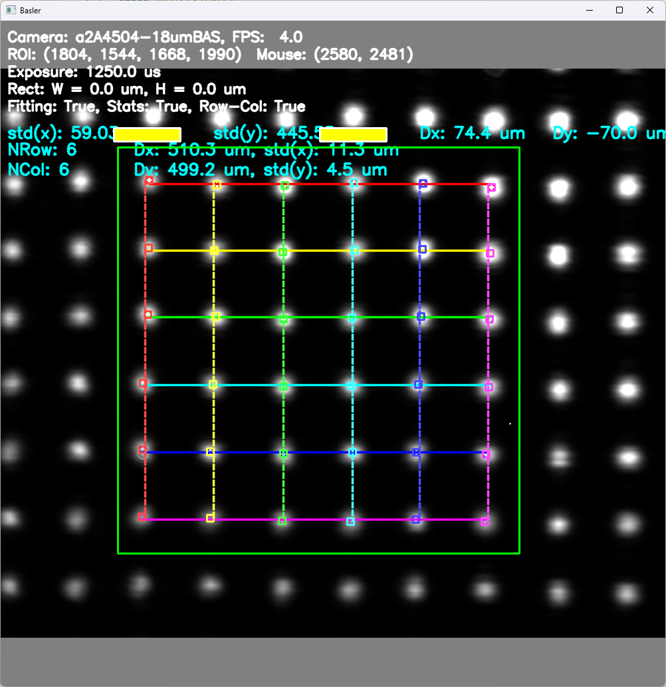

# Basler Beam Profiler

The Basler Beam Profiler is a Python application designed to interface with Basler cameras for beam profiling tasks.




## Usage
### Running the Application
```bash
python beam_profiler.py
```

### Configuring the camera

`camera_config.yaml`

```yaml
camera:
  a2A5060-15umBAS:                     # the name should match the camera name shown in pylon_camera
    default_roi: [5060, 5060, 4, 4]    # [width, height, x_pad, y_pad]
    pixel_size: 2.5e-6                 # pixel size in meters, i.e. 2.5um
```
### Using the compiled application
First clone this repo, setup `camera_config.yaml`

Check release to download the latest version: [Releases](https://github.com/tim4431/Basler_Beam_Profiler/releases)

Put the `pylon_camera.exe` executable in the same directory as `camera_config.yaml`.